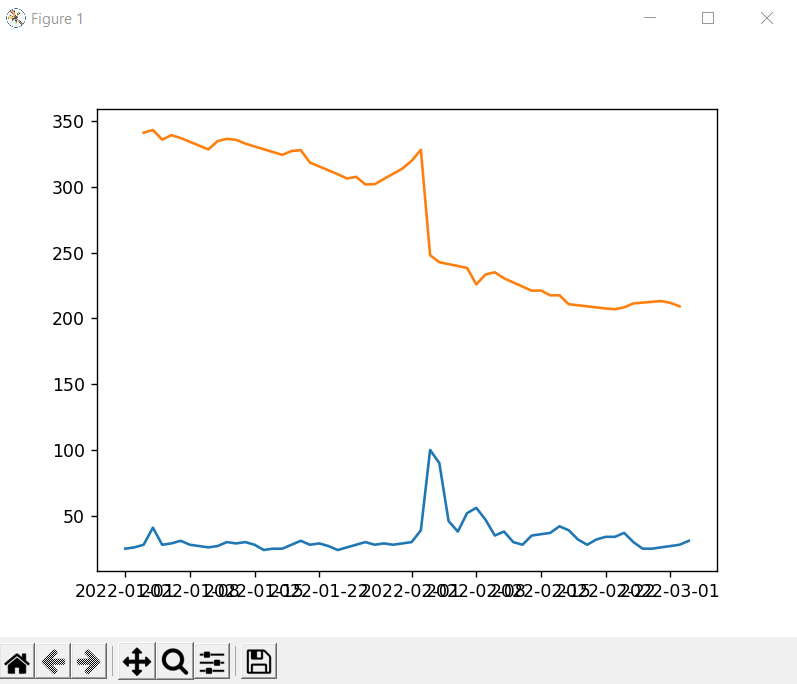

Relates stock ticker trend data to google search trends

How to install:

type `pip install requirements.txt` into a local terminal

and run with python 3.10

Here is an example graph of `META_2022-01-1_2022-03-03.ttr`:
